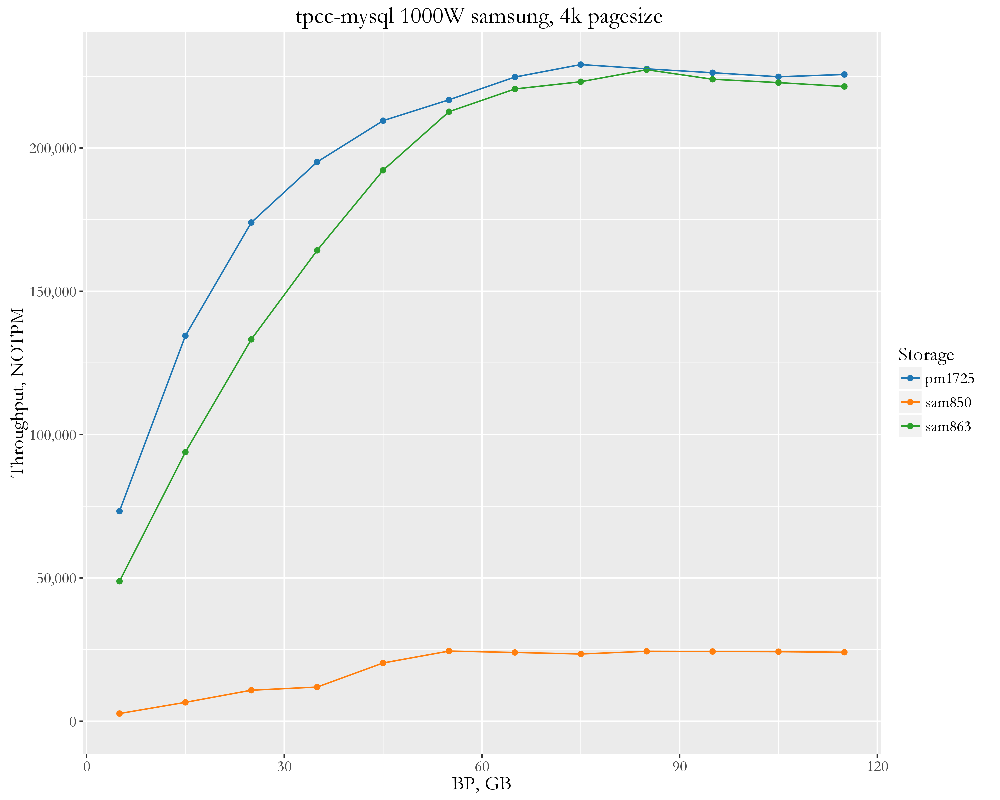

Percona Server/MySQL
====================

Setup
-----

-   Client (tpcc) and server are on the same server.
-   CPU: 56 logical CPU threads servers Intel(R) Xeon(R) CPU E5-2683 v3 @ 2.00GHz
-   tpcc 1000 warehouses, 1 schema (about 100GB datasize)
-   OS: Ubuntu 16.04 (Xenial Xerus)
-   Kernel 4.4.0-28-generic
-   Storage devices
-   Samsung SM863 SATA SSD, single device, with ext4 filesystem
-   Samsung 850 PRO SATA SSD, single device, with ext4 filesystem
-   Samsung PM 1725 NVMe SSD, single device

Results
=======

=============

cachesize vary
--------------

We are varying buffer pool size from 5GB to 115GB. With 5GB buffer pool size a very small partion of data fits into memory, this results in intesive foreground IO reads and intensive background IO writes.

With 115GB almost all data fits into memory, this results in a very small (or almost zero) IO reads, and moderate background IO writes.

All buffer pool sizes in the middle of interval results to corresponding IO reads and writes.

The measurements are taken every 1 sec, so we can see variance in throughput and trends

### Pagesize 16k

The results for innodb\_page\_size=16k (default), 1 sec resolution 

The average results in NOTPM 

#### Conclusion

Samsung 850 is obviously is not able to keep with with more advanced SM863 and PM1725

PM1725 shows a great benefit with small buffer pool sizes, while in case with big amount of memory, there is practically not difference with SM863. The reason is that with big buffer pool size MySQL does not push IO subsystem much to use all performance of PM1725

### Pagesize 4k

I also tested how innodb\_page\_size=4k affects the throughput

The average results in NOTPM 

### Summary

There I show average throughput (in Transactions per Minute) 
